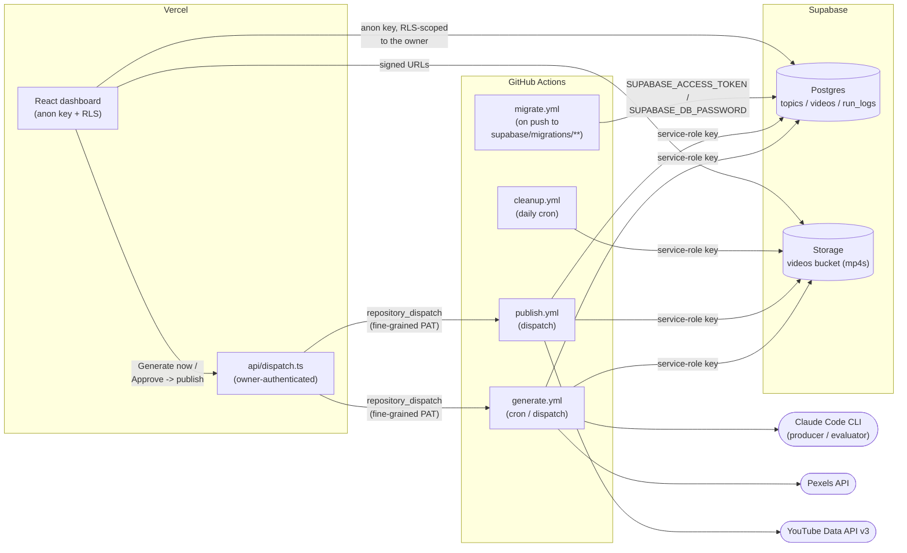
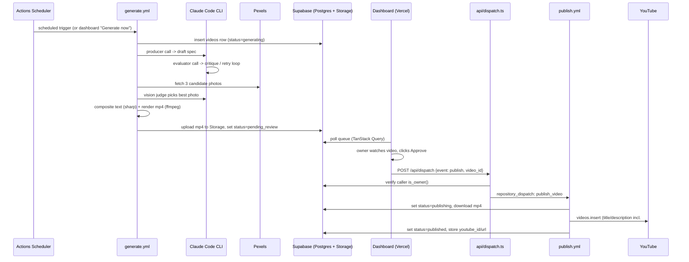
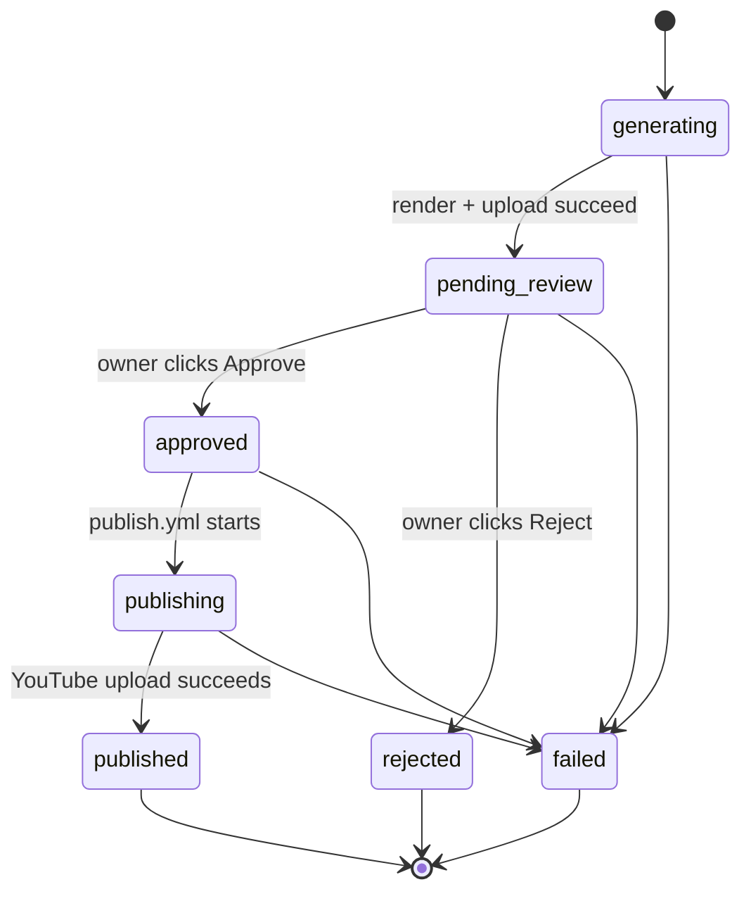

# agentic-media

An automated, faceless YouTube Shorts pipeline: an AI agent picks a topic, writes a short "fun fact" script, generates a vertical video (background image + text overlay + royalty-free music), and waits for a human to approve it before it ever reaches YouTube.

Built to explore agentic pipelines with a real human-in-the-loop gate, running entirely on free tiers (GitHub Actions, Supabase, Vercel, Claude Pro).

**Live example:** [Dose of Facts](https://youtube.com/@dose-of-facts-channel) is a YouTube channel running on this pipeline — every video is generated, reviewed, and published end-to-end by the flow described below.

## What it does

1. **Pick a topic** — a trending-topic lookup (or a manually supplied topic) anchors the fact so it isn't generic.
2. **Generate the script** — Claude runs a producer → evaluator feedback loop: one call drafts a fact/caption/image-prompt spec, a second call critiques it for accuracy, format, engagement, and novelty (checked against the 5 most recent facts so it doesn't repeat itself), and the critique is fed back for retries.
3. **Render the video** — fetch a matching background photo (Pexels, picked by a vision-based LLM judge from 3 candidates), composite the fact text onto it (`sharp`, SVG overlay), pick a royalty-free track, and render a 1080×1920 MP4 with FFmpeg.
4. **Human review** — the video lands in a small React dashboard at `pending_review`. The owner watches it and clicks Approve or Reject.
5. **Publish** — on approval, a GitHub Actions workflow uploads the MP4 to YouTube as a Short (private by default) and records the resulting URL.

## Architecture

Three systems, each doing the thing it's actually good at:



**Why this split:** Vercel Hobby functions are too small/short-lived for FFmpeg and can't hold the heavy pipeline secrets. All rendering and YouTube publishing run in GitHub Actions, which has FFmpeg preinstalled, generous free minutes, and can safely hold the Supabase **service-role key** (bypasses RLS) and the YouTube refresh token. Vercel hosts only the dashboard, using the public **anon key** — Postgres Row Level Security does the real access control, scoping every row to a single owner. The Vercel serverless route (`api/dispatch.ts`) holds neither secret; it only forwards a `repository_dispatch` event using a repo-scoped GitHub PAT, after checking the caller is the owner via their Supabase session.

### Generate → review → publish flow



### `videos.status` state machine



`rejected` and `failed` are terminal; `failed` is reachable from any active state on an unhandled error (with the error message stored on the row).

## Tech stack

- **Frontend**: React 18, TypeScript, Vite 6, Tailwind v4, TanStack Query, react-router, Supabase Auth. No `useEffect` + fetch — all data access goes through TanStack Query hooks.
- **Pipeline scripts**: Node + TypeScript (`tsx`), `sharp` for text compositing, FFmpeg for rendering, `googleapis` for the YouTube upload.
- **AI**: Claude Code CLI, run headless in Actions via a Claude Pro OAuth token (no per-token API billing). Sonnet 4.6 for generation/evaluation/image-judging, Haiku 4.5 for the cheap trending-topic lookup.
- **Data**: Supabase (Postgres + Storage), Row Level Security keyed to a single owner.
- **Hosting**: Vercel (dashboard + a single serverless dispatch route), GitHub Actions (everything else).
- **Testing**: Vitest + React Testing Library for deterministic unit tests; a separate real, model-graded eval suite for the AI prompts.

## Repo structure

```
src/                  React dashboard (features/<name>/{api.ts, use*.ts, pages})
api/                  Vercel serverless route (api/dispatch.ts)
scripts/              Pipeline scripts run by GitHub Actions (generate/publish/cleanup)
scripts/lib/          Shared pipeline logic (Supabase admin client, Claude prompts, rendering)
scripts/evals/        Real, model-graded prompt evals (not run in normal CI)
supabase/migrations/  Single consolidated schema migration
assets/music/         Curated royalty-free tracks + attribution
.github/workflows/    generate / publish / cleanup / migrate / ci / evals
```

## Setup / deploy guide

### 1. Supabase

1. Create a new Supabase project.
2. Apply the schema: either run `supabase db push` locally (after `supabase link --project-ref <ref>`) or paste `supabase/migrations/0001_initial_schema.sql` into the SQL editor. This single migration creates every table, the `is_owner()` RLS helper, all RLS policies, and the private `videos` Storage bucket.
3. Sign up in the app once (or create a user in Authentication), then set yourself as the owner:
   ```sql
   insert into public.app_config (id, owner_id)
   select true, id from auth.users where email = '<owner-email>'
   on conflict (id) do update set owner_id = excluded.owner_id;
   ```
   Until this row exists, `is_owner()` returns false and RLS hides every row from every authenticated session.
4. Note the project URL, anon key, service-role key, project ref, and (from Project Settings → Database) the database password. You'll also need a personal access token from [supabase.com/dashboard/account/tokens](https://supabase.com/dashboard/account/tokens) for `migrate.yml`.

### 2. GitHub Actions secrets

Add these under **Settings → Secrets and variables → Actions** (see `.env.example` for the full annotated list):

`CLAUDE_CODE_OAUTH_TOKEN`, `SUPABASE_URL`, `SUPABASE_SERVICE_ROLE_KEY`, `SUPABASE_PROJECT_REF`, `SUPABASE_ACCESS_TOKEN`, `SUPABASE_DB_PASSWORD`, `PEXELS_API_KEY`, `YT_CLIENT_ID`, `YT_CLIENT_SECRET`, `YT_REFRESH_TOKEN`, and optionally `YT_PRIVACY_STATUS`.

Get a Claude Code OAuth token with `claude setup-token` (requires a Claude Pro/Max subscription; the token is Claude-Code-only, not usable with the Messages API, and lasts about a year — note the rotation date). Get a Pexels key at [pexels.com/api](https://www.pexels.com/api/).

### 3. YouTube OAuth (one-time)

1. Create a Google Cloud project, enable the **YouTube Data API v3**.
2. Configure the OAuth consent screen (External, add yourself as a test user) and create an **OAuth Client (Desktop app)** to get a client ID/secret.
3. Obtain a refresh token for scope `https://www.googleapis.com/auth/youtube.upload` (e.g. via the OAuth Playground or a small local script).
4. Store `YT_CLIENT_ID` / `YT_CLIENT_SECRET` / `YT_REFRESH_TOKEN` as Actions secrets.

Note: uploads from an **unverified** API project land as **private** regardless of `privacyStatus` — publish them from YouTube Studio, or apply for a compliance audit to unlock public/unlisted uploads via the API.

### 4. Vercel

1. Deploy the repo to Vercel (framework preset: Vite).
2. Set `VITE_SUPABASE_URL` / `VITE_SUPABASE_ANON_KEY` (frontend), plus `GITHUB_DISPATCH_TOKEN` (a fine-grained PAT scoped to this repo, contents+metadata read is enough since it only triggers `repository_dispatch`), `GITHUB_REPOSITORY` (`owner/repo`), and `SUPABASE_URL`/`SUPABASE_ANON_KEY` for `api/dispatch.ts` to validate the caller's session.

### 5. Enable the schedule

`generate.yml`'s `schedule:` cron is what makes this run on its own — adjust the cron expression to taste, or trigger it manually from the Actions tab (`workflow_dispatch`, with an optional topic input) or the dashboard's "Generate now" button.

## Local development

```bash
npm install
npm run dev           # Vite dev server (dashboard only — the pipeline runs in Actions)
npm run build          # tsc -b && vite build
npm run typecheck
npm run lint
npm run format         # prettier --write .
```

## Testing

Two separate suites:

- **`npm run test`** — deterministic Vitest unit tests (`*.test.ts(x)`), mocking the `claude` CLI and Supabase. Runs in CI (`ci.yml`) on every push/PR.
- **`npm run eval`** — real, model-graded prompt evals (`scripts/evals/*.eval.ts`) that spawn the live `claude` CLI: a producer eval grades real output with an LLM judge, and an evaluator eval checks the evaluator itself accepts good specs and rejects bad ones. These need `CLAUDE_CODE_OAUTH_TOKEN` and cost real tokens, so they're excluded from `npm run test` and only run via `evals.yml` when a prompt file changes.

Run a single test file with `npx vitest run <path>`.

## Environment variables

See [`.env.example`](.env.example) for the complete, annotated list of every variable the project reads, grouped by where it's configured (local `.env.local`, GitHub Actions secrets, Vercel environment variables).

## Security model

- **Single-owner RLS**: every table's Row Level Security policy reduces to `public.is_owner()`, which checks `auth.uid()` against a single row in `app_config`. Anonymous and any non-owner authenticated session sees zero rows.
- **Secret boundaries**: the Supabase service-role key and YouTube credentials exist only as GitHub Actions secrets and are never imported by frontend code (`scripts/lib/supabaseAdmin.ts` is the only file that reads the service-role key). The Vercel route holds only a repo-scoped dispatch PAT and the public anon key.
- **Dispatch route auth**: `api/dispatch.ts` requires a valid Supabase session and re-checks `is_owner()` server-side before firing any `repository_dispatch` event; client-supplied fields are validated and length-capped.
- **Workflow least privilege**: every workflow declares `permissions: contents: read` — none of them need to write to the repo via `GITHUB_TOKEN`.
- **Fork PRs**: `ci.yml` and `evals.yml` run on `pull_request` (never `pull_request_target`), so GitHub automatically withholds repository secrets from fork-originated runs — `ci.yml` needs none anyway, and `evals.yml`'s eval step is expected to fail (not leak anything) on external contributors' PRs.

For the deeper implementation rationale (why each architectural choice was made, prompt design, the producer/evaluator loop, etc.) see [`CLAUDE.md`](CLAUDE.md).

## License

[MIT](LICENSE)
